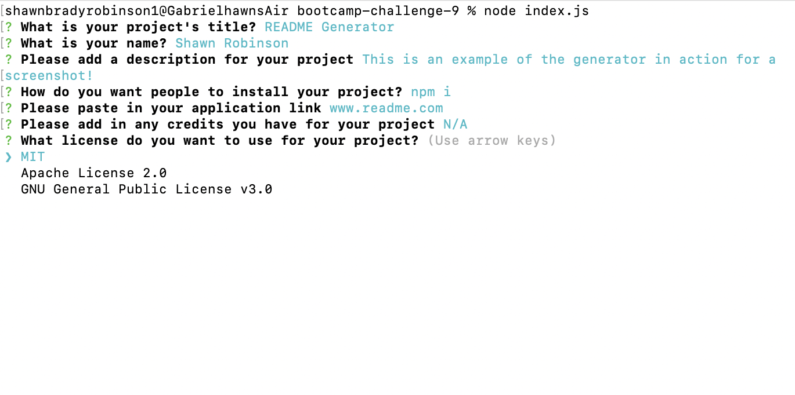

# README Generator

## Shawn Robinson

## **Description**
The README Generator is a command-line application that will help developers create a README file for their project in a fraction of the time it would take otherwise! All formatting of links and headers is handled for the user, all they have to do is enter the correct information. 

## Credits
Starter code was provided for the project. Inquirer is used to help gather user information. 
## License
MIT License

## Demo Video 
[Click here to view the demo video](https://watch.screencastify.com/v/rSM2ffpO1YNJeJOhsW1l)

## License 
MIT License

Copyright (c) 2023 shawnbradyrobinson

Permission is hereby granted, free of charge, to any person obtaining a copy
of this software and associated documentation files (the "Software"), to deal
in the Software without restriction, including without limitation the rights
to use, copy, modify, merge, publish, distribute, sublicense, and/or sell
copies of the Software, and to permit persons to whom the Software is
furnished to do so, subject to the following conditions:

The above copyright notice and this permission notice shall be included in all
copies or substantial portions of the Software.

THE SOFTWARE IS PROVIDED "AS IS", WITHOUT WARRANTY OF ANY KIND, EXPRESS OR
IMPLIED, INCLUDING BUT NOT LIMITED TO THE WARRANTIES OF MERCHANTABILITY,
FITNESS FOR A PARTICULAR PURPOSE AND NONINFRINGEMENT. IN NO EVENT SHALL THE
AUTHORS OR COPYRIGHT HOLDERS BE LIABLE FOR ANY CLAIM, DAMAGES OR OTHER
LIABILITY, WHETHER IN AN ACTION OF CONTRACT, TORT OR OTHERWISE, ARISING FROM,
OUT OF OR IN CONNECTION WITH THE SOFTWARE OR THE USE OR OTHER DEALINGS IN THE
SOFTWARE.

## Questions
If you have further questions, I can be contacted at: 
- (https://www.github.com/shawnbradyrobinson)
- shawnbradyrobinson1@gmail.com 